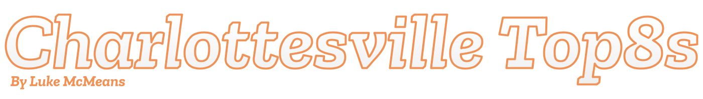

# charlottesville-top8s

This website generates Top 8 graphics for tournament results inputted by the user, with designs custom-made for the local tournaments of Charlottesville and the University of Virginia. Users are able to display each player's name, X/Twitter handle, primary character, and secondary characters, with the ability to upload a custom photo if desired. Along with this, there is also the ability to report winners for redemption bracket and for an additional side bracket conducted at the venue. 

Inspired by top8er.com by @Riokaru and @Elenriqu3

**_VISIT_**: https://charlottesville-top8s-50b4ab9ef36b.herokuapp.com/
